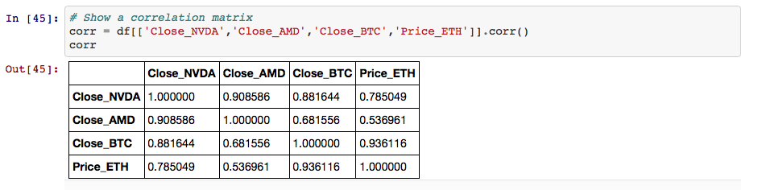

# Relationship between Cryptocurrencies and Processor Companies

##### Hypothesis
***
Crpytocurrencies (BTC and ETH) affect stock prices of Processor Comapnies (AMD and NVDA)

##### Basic Price Information (01/01/2016 - 08/25/2017)
***
* BTC (mean=1088.73 , sd=884.57)
* ETH (mean=56.74 , sd=94.60)
* AMD (mean=8.15 , sd=4.21)
* NVDA (mean=82.66 , sd=42.94)

##### Results
***
We found a strong corrleation between the crpytocurrencies and the stocks
* BTC and AMD: r=0.68
* BTC and NVDA: r=0.88
* BTC and ETH: r=0.94
* ETH and AMD: r=0.54
* ETH and NVDA: r=0.79
* AMD and NVDA: r=0.91

Also, using a t-test, we were able to confirm that the crptocurrencies (BTC and ETH) are significantly different from each other.
* t(414)=23.63 , p-value~=0

##### Conclusion
***
We were able to conclude that there is a positive correlation between crpytocurrency prices and stock prices of processor comapnies. This implies that when the prices of crpytocurrencies increase, we can expect the stock prices of processor companies to increase as well. It is important to note that Correlation does not equal Causation.

##### Contributors
***
Jonathan Lee [GitHub](https://github.com/jonyclee)
Johnny Li [GitHub](https://github.com/johnnyli93)

##### Technologies Used:
***
* Python notebook
* Python packages:
	- Pandas
	- Numpy
	- Matplotlib.pyplot
	- Datetime
	- String
	- Scipy.stats
	- Quandl
	- Requests